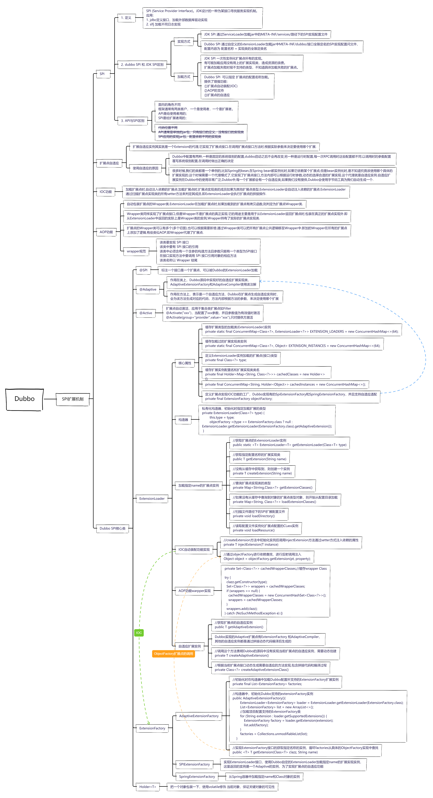

# wanglufei-rpc  

> this is wanglufei's rpc framework!
## 1.0版本功能 20210729
- [x] 服务注册
- [x] 服务发现
- [x] 服务调用
- [x] 实现socket transport  
- [ ] SPI加载实现  
- [x] demo调用

### 遗留问题

- 服务端异常传递到客户端
- SPI扩展加载实现类

### 知识短板

- socket编程
    - `ObjectInputStream`,`ObjectOutputStream`,`Socket`API使用
- Proxy代理  
    - `InvocationHandler`API使用
- SPI扩展加载
- git tag应用
  - git tag -a 1.0 创建tag
  - git tag -d 1.0 删除tag
  - git push origin 1.0 推到远程仓库

# 1.1版本功能  
- [x] SPI扩展加载具体实现类
  - [x] 注册中心SPI实现
  - [x] 负载均衡  
- [ ] _Netty底层网络通信实现_ todo 由于涉及到netty知识，等到有一定的netty知识储备后来实现

### SPI 扩展加载类
1. 加载classpath路径下的properties文件
2. 实例化指定name的实现类
3. SPI注解定义
### zk注册中心SPI类
已实现SPI加载方式

### 负载均衡SPI实现类
randomLoadBalance实现类已实现SPI加载方式，且实现了Dubbo的IOC功能

### 遗留问题
- [x] com.wlufei.rpc.framework.client.SocketRPCClient.sendRPCRequest#socket.connect(inetSocketAddress);偶尔超时  
   客户端调用超时问题,原因是zk上注册了公司的IP相同的服务,随机的调用到无效的IP上导致超时

### 知识短板
1. Class 相关API,如 `clazz.newInstance()`,`Class<?> clazz = Class.forName(line, true, classLoader)`

# 1.2 版本功能
- [ ] SPI扩展加载增强功能实现  
  - [x] 实现服务注入
  - [ ] wrapper增强功能
- [ ] Protocol 协议
  - [ ] 定义通过协议的服务暴露和服务引用流程
  - [ ] 实现自定义Protocol实现类

### 遗留问题
- [x] ExtensionLoader自适应扩展javassist编译代码问题 修改自定义的URL.class类型

### SPI机制总结

> 参考内容
> 1. [dubbo可扩展机制源码解析](https://dubbo.apache.org/zh/blog/2019/05/02/dubbo%E5%8F%AF%E6%89%A9%E5%B1%95%E6%9C%BA%E5%88%B6%E6%BA%90%E7%A0%81%E8%A7%A3%E6%9E%90/)
> 
